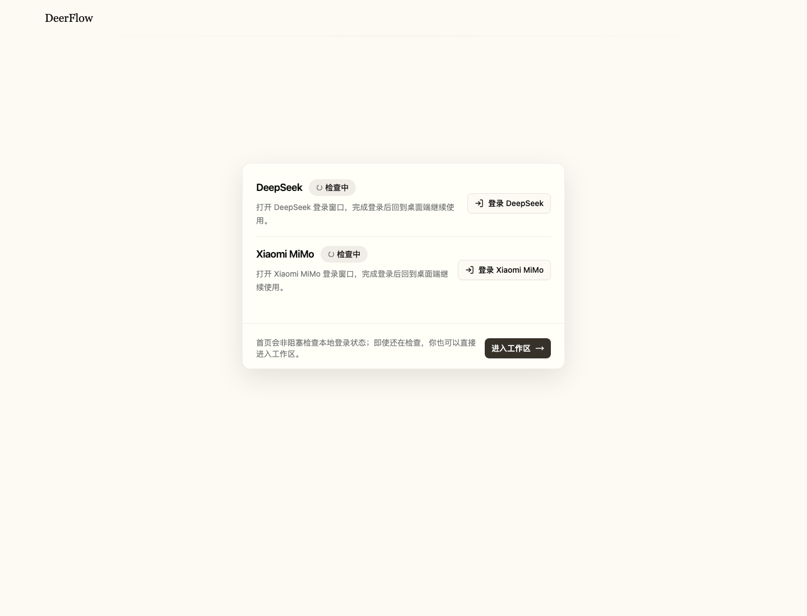

# Free Deer Flow

Free Deer Flow 是基于 DeerFlow 2.0 改造的本地 Agent 工作台。项目保留 DeerFlow 的多 Agent、skills、artifacts、工作区文件等能力，并重点解决一个实际问题：如何把 DeepSeek / 小米 MiMo 这类网页模型接入本地 Agent 工作流。

## 项目亮点

- 网页模型本地化：通过 Playwright 浏览器自动化复用网页登录态，将 DeepSeek / Xiaomi MiMo 网页会话包装成本地模型服务。
- OpenAI 兼容接口：本地 provider 通过 FastAPI 暴露 chat/responses/messages 风格接口，方便 DeerFlow 模型层调用。
- 桌面工作台：Electron 负责拉起 provider、Gateway 和前端，用户可以用桌面应用方式进入工作区。
- 工作区产物管理：保留 thread files、artifacts、uploads、workspace 等接口，方便查看、下载和管理 Agent 生成文件。
- 登录引导：首页提供 DeepSeek / Xiaomi MiMo 登录状态检测和登录入口，降低首次使用成本。
- 多模式运行：支持本地开发、Gateway mode、Docker 和 macOS 桌面模式，便于调试和分发。
- 本地 Agent 闭环：让网页模型也能参与资料整理、文件生成、多轮任务执行和工作区产物沉淀。

## Screenshots



## Tech Stack

- Python 3.12+
- FastAPI Gateway
- LangGraph / LangChain runtime
- Next.js 16 + React 19 frontend
- Electron desktop shell
- Playwright browser automation
- pnpm / uv

## Project Structure

```text
backend/
├── app/deepseek_local_provider.py       # DeepSeek / Xiaomi MiMo local provider
├── app/gateway/                         # FastAPI Gateway 和桌面 API
└── packages/harness/deerflow/           # DeerFlow agent harness

frontend/
├── src/components/landing/              # 登录入口首页
├── src/components/workspace/            # 工作区 UI
└── src/core/                            # models、threads、workspaces、provider auth

desktop/electron/
├── main.cjs                             # Electron 主进程和服务编排
└── static-server.cjs                    # 静态前端服务
```

## Getting Started

```bash
make config
make install
make dev
```

macOS 桌面模式：

```bash
make desktop-mac
```
